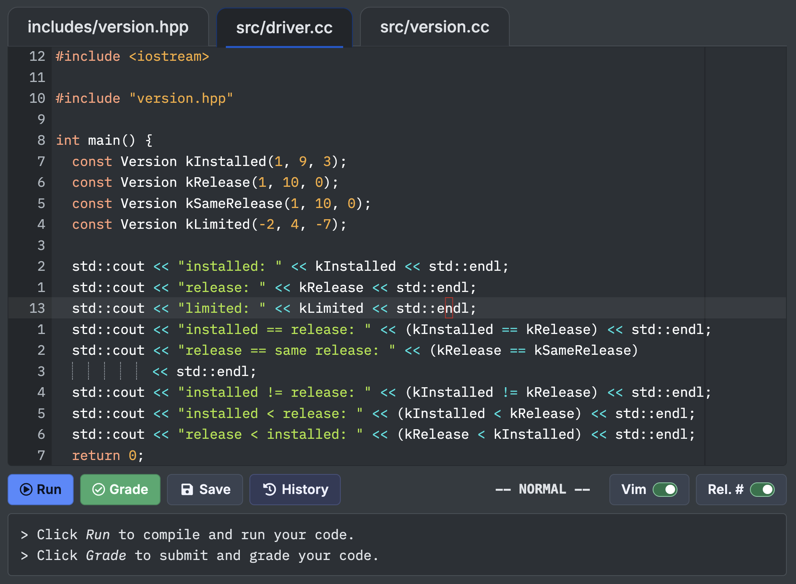

# CS 128 Vim + Quick Tab

A  Chrome extension that enables standard Vim editing in CS 128 Programming Activities as well quick tab switching with "Alt + ]" & "Alt + [" for Windows and "Option + ]" & "Option + [" for Mac. It attaches to the site's existing Ace editors and starts in **Normal** mode. Every file tab in an activity is covered.

## Install in Chrome (Mac and Windows)

1. Open the [latest release](https://github.com/jiminn-lee/cs128-vim/releases/latest). Under **Assets**, download the file named `cs128-vim-<version>.zip`, such as `cs128-vim-1.4.0.zip`.
2. Extract the ZIP. On **Mac**, double-click it. On **Windows**, right-click it and choose **Extract All**.
3. Move the extracted **cs128-vim** folder to a permanent location, such as an Extensions folder in Documents. Keep it there while the extension is installed; Chrome loads the files from that location.
4. Open `chrome://extensions` in Chrome and turn on **Developer mode** in the upper-right corner.
5. Click **Load unpacked** and select the **cs128-vim** folder that directly contains `manifest.json`. Select the folder itself, not the ZIP or an outer folder created during extraction.
6. Sign in to CS 128 and open a lesson's **Programming Activity**. If the lesson is already open, save any work with the site's **Save** button, then refresh the page.

The release ZIP is ready to load without building anything. If you cloned the repository instead, select its **extension** folder in step 5.

The **Vim** switch and mode indicator appear at the bottom right, on the same row as **Run**, **Grade**, **Save**, and **History**. Modes are shown as **-- NORMAL --**, **-- INSERT --**, or **-- VISUAL --**. Vim starts in Normal mode: press **i** to type and **Esc** to return to Normal mode. Turning Vim off restores ordinary editing and hides the mode label. The Vim button shows just its name and a switch icon.

When the activity action row is narrow, the controls collapse into a **•••** button. Open it to use the Vim and Rel. # switches or see the current mode. Escape, clicking outside, or moving keyboard focus away closes the menu. Widening the activity restores the inline controls without changing either setting.

## Updating an existing installation

**GitHub releases do not update the installed extension automatically.** To install a newer version:

1. Download and extract the ZIP from the [latest release](https://github.com/jiminn-lee/cs128-vim/releases/latest).
2. Replace the files inside your existing **cs128-vim** installation folder with the files from the new release. Keep the installation folder at the same location.
3. Open `chrome://extensions` and click the **Reload** button (circular arrow) on **CS 128 Vim**.
4. Save any open coursework with the site's **Save** button, then refresh the CS 128 lesson.

If you moved or deleted the installation folder, remove the old extension entry in `chrome://extensions` and use **Load unpacked** to select the new folder. If you installed from the repository, update its files, then follow steps 3–4.

## Use

| Keys | Action |
| --- | --- |
| `h j k l`, `w b e`, `0 $`, `gg G` | Move |
| `i`, `a`, `o` | Enter Insert mode |
| `Esc` | Return to Normal mode; keep focus in the editor |
| `v`, `V`, `Ctrl-v` | Visual, Visual Line, Visual Block |
| `dd`, `dw`, `ciw`, `yy`, `p` | Delete, change, yank, paste |
| `u`, `Ctrl-r`, `.` | Undo, redo, repeat |
| `/pattern`, `n`, `N` | Search and jump between matches |
| Counts such as `3w`, `2dd` | Repeat a motion or operator |
| Mac: `Option + [` / `Option + ]` | Previous / next file tab |
| Windows: `Alt + [` / `Alt + ]` | Previous / next file tab |

The file-tab shortcuts work while the activity's code editor has focus, in every Vim mode and with Vim off. They follow the displayed tab order, wrap at either end, and put the cursor in the selected file's editor. Disabled or hidden tabs are skipped. Search boxes and other inputs keep their normal keyboard behavior. On Mac, the shortcuts use the physical bracket keys so Option-generated punctuation does not get inserted into your code.

Use CS 128's **Save**, **Run**, and **Grade** buttons as usual. The `:` command prompt is disabled, as are `ZZ` and `ZQ`. There are no Vim save/quit commands. `/` and `?` search still work, and you can type colons normally in Insert mode. Vim yanks use Ace's internal registers; normal system copy/paste is still available, subject to browser shortcuts.

Click the **Vim** switch to turn it off for all files in that activity. This restores the site's keyboard handler and its Escape-to-file-tabs shortcut. The switch lasts for the current activity on the current page; a reload or new lesson starts enabled again. Browser-reserved shortcuts are still controlled by Chrome.

The separate **Rel. #** switch toggles relative line numbers for every file in that activity, independently of Vim. Other lines show their distance from the cursor; the current line keeps its actual line number. Turn it off to return to absolute numbers. Relative numbers start off and reset on page reload or navigation.

Vim runs only in activity workspaces on `https://cs128.org/*`. Smaller runnable examples, ordinary form inputs, and other websites are unaffected. This is Ace's Vim emulation, not Neovim; vimrc files and plugins are not supported.

## Troubleshooting

- If Chrome cannot find `manifest.json`, make sure you extracted the release ZIP and selected the folder directly containing that file.
- After installing, reloading the extension, disabling it, or removing it, refresh the lesson. Chrome does not undo already injected page scripts when an extension is disabled.
- If the status says **-- UNAVAILABLE --**, ordinary editing remains available. Toggle Vim off/on to retry. A future CS 128 editor update may require a compatibility update.
- If no switch appears, check that you're signed in and looking at an editable Programming Activity, and that Chrome allows the extension on `cs128.org`.

All extension code is local. There is no analytics, backend, credential access, or collection of coursework. See the bundled third-party notices and Ace license.
